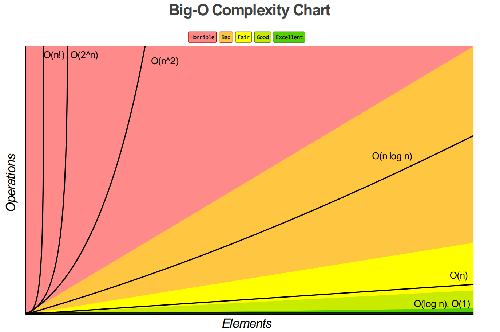
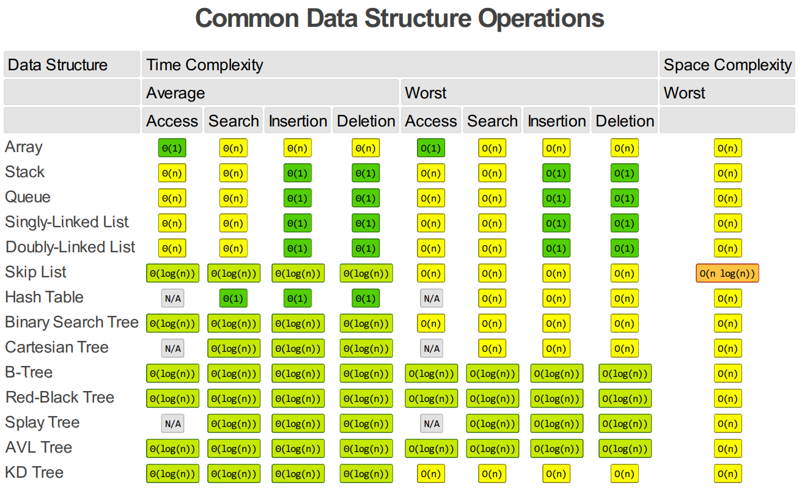
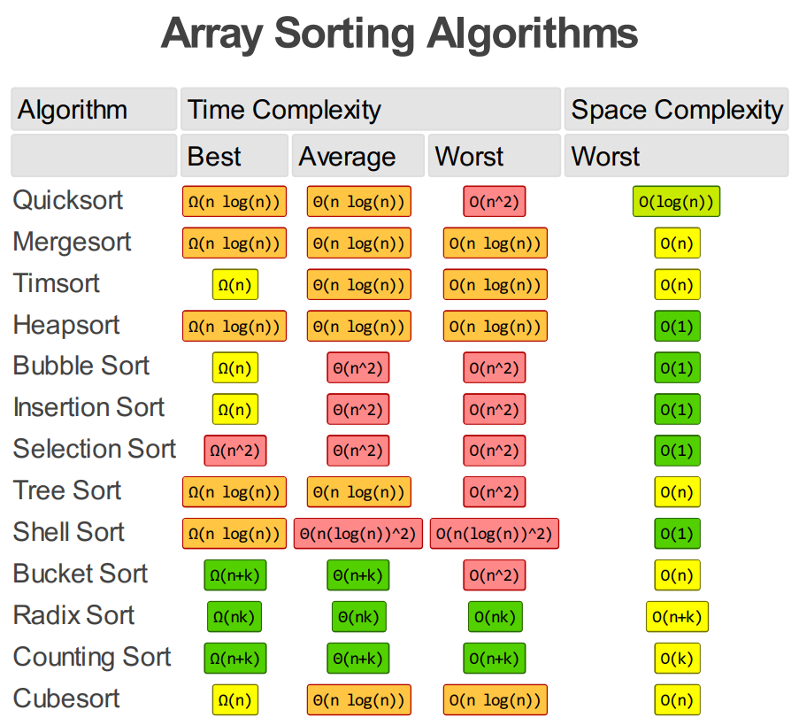

# Data structures
<h3>Strukture podataka</h3>
<h4>Elektronski fakultet Niš</h4>
<h4>Sadržaj</h4>
<ol>
    <li>Polja</li>
    <ul>
        <li>Jednodimenziona</li>
        <li>Višedimenziona</li>
    </ul>
    <li>Lančane liste</li>
    <ul>
        <li>Dinamička implementacija</li>
        <ul>
            <li>Jednostruko ulančana sa pokazivačem na kraj liste</li>
            <li>Dvostruko ulančana sa pokazivačem na kraj liste</li>
            <li>Retko posegnuta matrica</li>
        </ul>
        <li>Statička implementacija</li>
        <ul>
            <li>Jednostruko ulančana</li>
        </ul>
    </ul>
    <li>Stack (Statička i dinamička implementacija)</li>
    <li>Red (Statička i dinamička implementacija)</li>
    <li>Dvostrani red (Deque) (Statička i dinamička implementacija)</li>
    <li>Heš tablice</li>
    <ul>
        <li>Heš tablica sa spoljašnjem ulančavanjem sinonima</li>
        <li>(Rasuta) Heš tablica sa unutrašnjem ulančavanjem sinonima</li>
        <li>(Rasuta) Heš tablica sa otvorenim adresiranjem sinonima</li>
    </ul>
    <li>Stabla</li>
    <ul>
        <li>Binarno stablo pretrage (BST)</li>
        <ul>
           <li>Statička implementacija preko polja</li>
        </ul>
        <li>Gomila (Min-heap i max-heap)</li>
        <ul>
           <li>Statička implementacija preko polja</li>
        </ul>
    </ul>
    <li>Grafovi</li>
        <ul>
            <li>Dinamička implementacija usmerenog težinskog grafa listom susedstva</li>
        </ul>
</ol>

 
 
 
 
